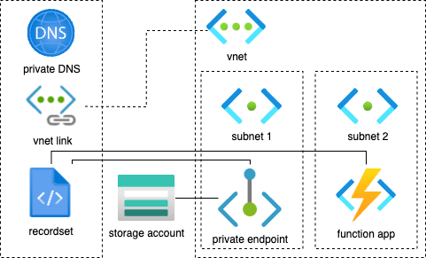

# IaaC with Azure CLI

Scenario:
There is a Storage Account with a disabled public access.
The Storage Account has an approved private endpoint connection.
The Private Endpoint is inside a Virtual Network within a subnet, it has a network interface which has a private IPv4 address.
There is a Function App witin the same Virtual Network (perhaps in a different subnet).
The Function app calls the standard connection string:
```python
connection_string = f"DefaultEndpointsProtocol=https;AccountName={storage_account_name};AccountKey={storage_account_key};EndpointSuffix=core.windows.net"
```
The endpoint suffix yields a DNS name like `somestorageaccount.blob.core.windows.net`.
There is a DNS zone, it has a VNet link to the same Virtual Network. The DNS has an internal recordset that maps the storage account to a private IPv4 address.



NB: The resources must be in the same location.

If the DNS is not configured, then the connection string must point directly to the IP address of the Private Endpoint.

```python
connection_string = f"DefaultEndpointsProtocol=https;AccountName={storage_account_name};AccountKey={storage_account_key};BlobEndpoint=https://{private_endpoint_private_ip_address}:443/"
```


## Requirements

* Azure subscription
* Azure CLI: to sing-in to the Azure account

```shell
# Azure CLI expected version: 2.61 or higher
az --version
```

## Create Azure resources

1. Create a Resource Group

```shell
az group create 
    --name $RESOURGE_GROUP_NAME 
    --location $LOCATION
```

2. Create a Virtual Network with a Subnet

Create a virtual network with a subnet. This is required, because when you create a private endpoint for an Azure resource, such as a storage account, the resource is accessible only within your virtual network.

```shell
# Create a Virtual Network with a Subnet
az network vnet create \ 
    --resource-group $RESOURCE_GROUP_NAME \ 
    --name $VNET_NAME \ 
    --address-prefix 10.0.0.0/16 \ 
    --subnet-name $SUBNET_NAME \ 
    --subnet-prefix 10.0.0.0/24
```

3. Create a Storage Account that will be protected with private endpoint

ref: https://learn.microsoft.com/en-us/cli/azure/storage/account?view=azure-cli-latest#az-storage-account-create

```shell
az storage account create \ 
    --resource-group $RESOURCE_GROUP_NAME \ 
    --name $STORAGE_NAME \ 
    --sku Standard_LRS
    --public-network-access Disabled
```

4. Create a Private Endpoint for the storage account.

Create a DNS A record in the private DNS zone to map the storage account to the private IP address.

```shell
# Get the Storage Account ID, on Unix use export NAME=VALUE
STORAGE_ACCOUNT_ID=$(az storage account show \ 
    --resource-group $RESOURCE_GROUP_NAME \ 
    --name $STORAGE_ACCOUNT_NAME \ 
    --query "id" \ 
    --output tsv \ 
)
# Create a Private Endpoint
az network private-endpoint create \ 
    --resource-group $RESOURCE_GROUP_NAME \ 
    --vnet-name $VNET_NAME \ 
    --subnet $SUBNET_NAME \ 
    --name $PRIVATE_ENDPOINT_NAME \ 
    --private-connection-resource-id $STORAGE_ACCOUNT_ID \ 
    --group-id blob \ 
    --connection-name 'connection'
```

5. Create a private DNS Zone

Create a private DNS zone and link it to the virtual network. This is recommended because: Applications typically access the resource using its public DNS name (e.g., mystorageaccount.blob.core.windows.net). To ensure that your applications can resolve the private IP address of the resource, you need to configure DNS settings.

```shell
# Create a Private DNS Zone, e.g. dnszone1.local
az network private-dns zone create \ 
    --resource-group $RESOURCE_GROUP_NAME \ 
    --name $PRIVATE_DNS_ZONE
# Link the Private DNS Zone to the Virtual Network
az network private-dns link vnet create \ 
    --resource-group $RESOURCE_GROUP_NAME \ 
    --virtual-network $VNET_NAME \ 
    --name 'DNSLink' \ 
    --zone-name $PRIVATE_DNS_ZONE \ 
    --registration-enabled false
# Get the Network Interface ID of the Private Endpoint, on Unix use export NAME=VALUE
NIC_ID=$(az network private-endpoint show \ 
    --resource-group $RESOURCE_GROUP_NAME \ 
    --name $PRIVATE_ENDPOINT_NAME \ 
    --query "networkInterfaces[0].id" \ 
    --output tsv \ 
)
# Get the Private IP Address of the Private Endpoint, on Unix use export NAME=VALUE
PRIVATE_IP=$(az network nic show \ 
    --ids $NIC_ID \ 
    --query "ipConfigurations[0].privateIPAddress" \ 
    --output tsv \ 
)
# Create a DNS A Record in the Private DNS Zone
az network private-dns record-set a create \ 
    --resource-group $RESOURCE_GROUP_NAME \ 
    --zone-name $PRIVATE_DNS_ZONE \ 
    --name $STORAGE_ACCOUNT_NAME
az network private-dns record-set a add-record \ 
    --resource-group $RESOURCE_GROUP_NAME \ 
    --zone-name $PRIVATE_DNS_ZONE \ 
    --record-set-name $STORAGE_ACCOUNT_NAME \ 
    --ipv4-address $PRIVATE_IP
```

5. Create a Storage Account

This is used by the Function App.

ref: https://learn.microsoft.com/en-us/cli/azure/storage/account?view=azure-cli-latest#az-storage-account-create

```shell
az storage account create \ 
    --resource-group $RESOURCE_GROUP_NAME \ 
    --name $STORAGE_NAME \ 
    --sku Standard_LRS
```

6. Create an App Service Plan

This hosts the Function App

ref: https://learn.microsoft.com/en-us/cli/azure/appservice/plan?view=azure-cli-latest#az-appservice-plan-create

```shell
az appservice plan create \ 
    --resource-group $RESOURCE_GROUP_NAME \ 
    --name $APP_PLAN_NAME
    --is-linux
```

7. Create an Azure Function App

NB: ClickOps only supports CD from GitHub

ref: https://learn.microsoft.com/en-us/cli/azure/functionapp?view=azure-cli-latest#az-functionapp-create

Remember to configure CORS as appropriate.

```shell
# Create the Function App
az functionapp create \ 
  --resource-group $RESOURGE_GROUP_NAME \ 
  --plan $APP_PLAN_NAME \ 
  --name $APP_NAME \ 
  --os-type Linux
  --runtime python
  --runtime-version 3.11
  --storage-account $STORAGE_NAME

# Get the Subnet ID
SUBNET_ID=$(az network vnet subnet show \ 
    --resource-group $RESOURCE_GROUP \ 
    --vnet-name $VNET_NAME \ 
    --name $SUBNET_NAME \ 
    --query "id" \ 
    --output tsv \ 
)

# Enable VNet Integration for the Function App
az webapp vnet-integration add \ 
    --resource-group $RESOURCE_GROUP \ 
    --name $FUNCTION_APP_NAME \ 
    --vnet $VNET_NAME \ 
    --subnet $SUBNET_NAME
```
