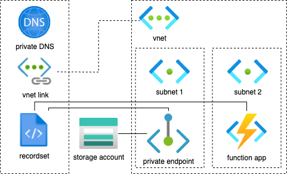

# IaaC with Azure Bicep

Scenario:
There is a Storage Account with a disabled public access.
The Storage Account has an approved private endpoint connection.
The Private Endpoint is inside a Virtual Network within a subnet, it has a network interface which has a private IPv4 address.
There is a Function App witin the same Virtual Network (perhaps in a different subnet).
The Function app calls the standard connection string:
```python
connection_string = f"DefaultEndpointsProtocol=https;AccountName={storage_account_name};AccountKey={storage_account_key};EndpointSuffix=core.windows.net"
```
The endpoint suffix yields a DNS name like `somestorageaccount.blob.core.windows.net`.
There is a DNS zone, it has a VNet link to the same Virtual Network. The DNS has an internal recordset that maps the storage account to a private IPv4 address.



NB: The resources must be in the same location.

To make calls to private endpoints, DNS lookups must resolve to the private endpoint. If the DNS is _not_ configured, then the connection string must point directly to the IP address of the Private Endpoint. This will likely create issues for example 1) the server not knowing which domain is requested without host header or 2) issues with the SSL certificate.

```python
connection_string = f"DefaultEndpointsProtocol=https;AccountName={storage_account_name};AccountKey={storage_account_key};BlobEndpoint=https://{private_endpoint_private_ip_address}:443/"
```

## Requirements

* Azure subscription
* Azure CLI: to sing-in to the Azure account
* Azure Bicep

```shell
# Azure CLI expected version: 2.61 or higher
az --version
# Azure Bicep expected version: v0.30.x or higher
az bicep version
```


## Create Azure resources

1. Create a Resource Group

2. Create a Virtual Network with a Subnet

3. Create a Storage Account with a Private Endpoint
public network disabled

4. Create a Private DNS Zone and link it to the Virtual Network

5. Create an App Service Plan

6. Create an Azure Function App with VNet Integration

Remember to configure CORS as appropriate.

Deploy this Bicep template using the Azure CLI:

ref: https://learn.microsoft.com/en-us/azure/azure-resource-manager/bicep/deploy-cli

ref: https://learn.microsoft.com/en-us/cli/azure/deployment/group?view=azure-cli-latest#az-deployment-group-create

```shell
az group create \ 
    --resource-group $RESOURCE_GROUP_NAME \ 
    --location $LOCATION \ 
    --tags Owner=$USERNAME

az deployment group create \ 
    --resource-group $RESOURCE_GROUP_NAME \ 
    --name 'myDeployment-'$(date +"%Y-%b-%d")
    --template-file $PATH_TO_BICEP_FILE \ 
    --parameters $PATH_TO_BICEPPARAM_FILE 
```

validate
```shell
az resource list --resource-group $RESOURCE_GROUP_NAME
```